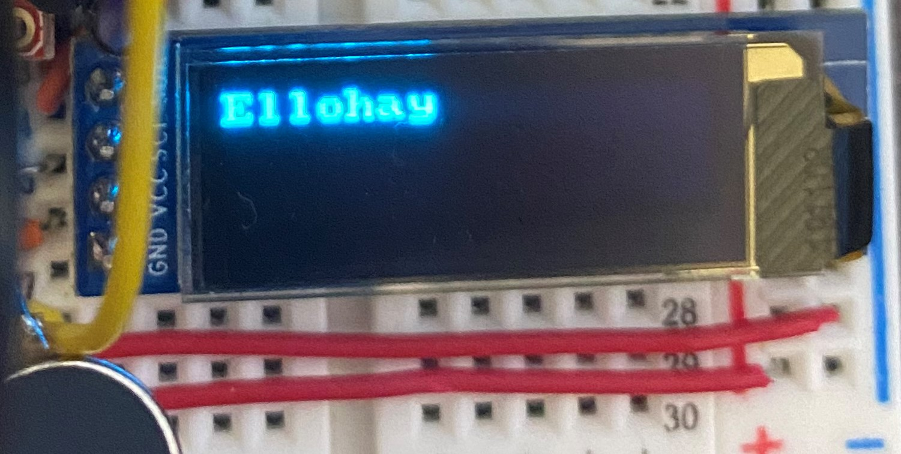
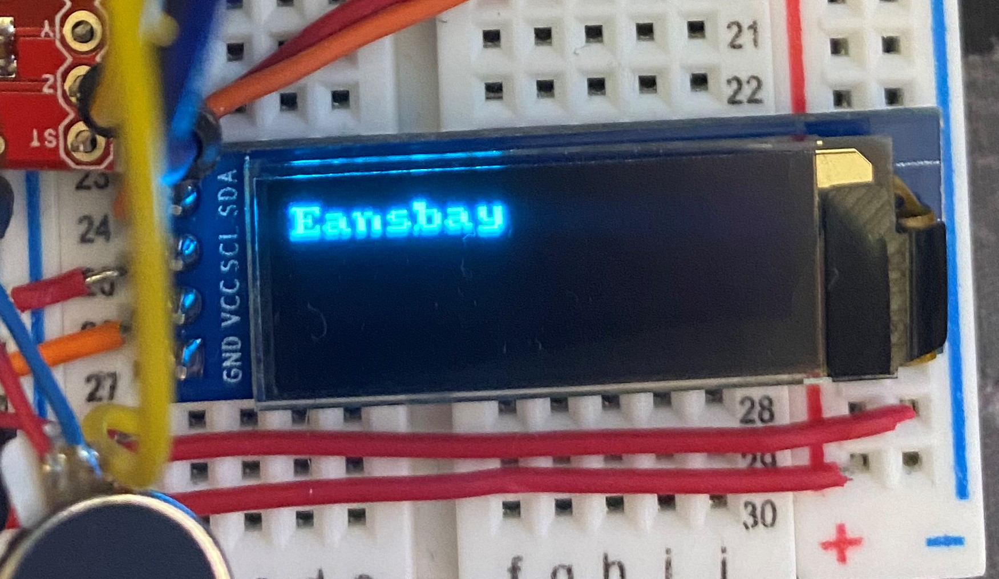
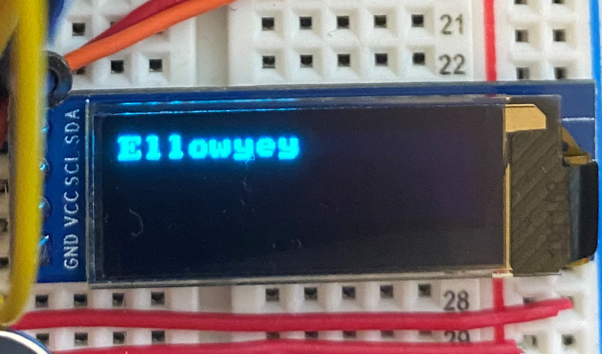
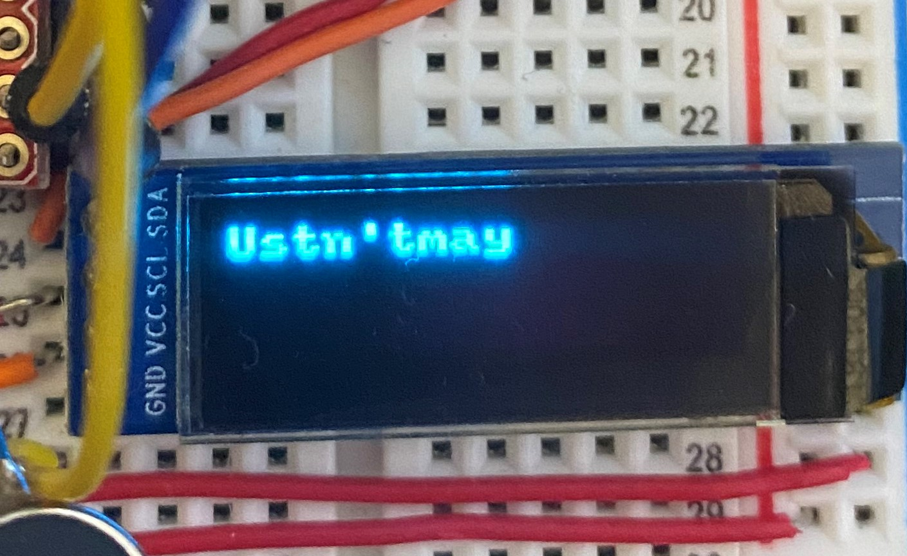
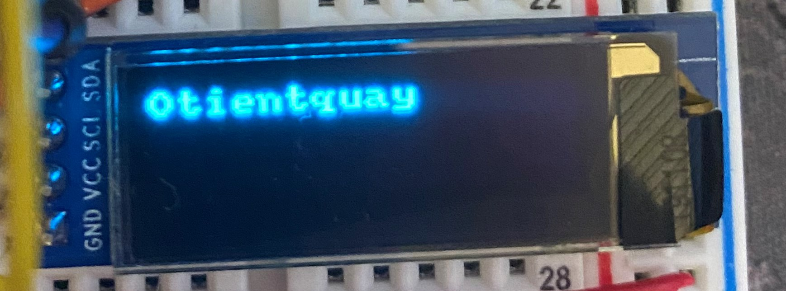

# ECE16 Lab 3 Report (Python)
Prepared by: Yusuf Morsi

Date: 02/07/2021

**Tutorial_Python_Basics** teaches us the basics of python programming. Not only do we excute a 'Hello World' program. bu we also work with different data types, experiment with lists, and accessing certain elements in the lists. In addition, we gain experience using the del() function, different comprehensions, mathamatical functions, strings, loops, and creating our own functions.

**Tutorial Pyserial** begins by leading us through the process of installing 'pyserial.' After importing both 'serial' and 'time' at the top of the file, we learn to connect our Arduino to the Python file. Subsequent to creating functions that allow us to send and recieve data with the MCU and close the Serial Port, we work with programming our OLED with Python. We write code in the Arduino IDE for initializing the communication protocol and sending and recieving messages. In our Python code, we utilize the readline() function to read data sent by the MCU. After running this code, we set up Bluetooth communication by creating and naming a port in our Arduino code. After this, we enter our computer's settings to connect the device, and after it connects, we make a few changes in our Python code to get our output printed on the OLED!

**Challenge 1: Pig Latin** teaches us to implement loops and functions in Python. In this assignment, we need to create Python code that removes consonants before a vowel to the end of the word before an 'ay,' has us move all the consonants leading up to the first vowel of a word that starts with 'y' with 'ey' appended at the end, and has us append 'yay' at the end of words that start with vowels. We also need to do this backwards utilizing 'pyenchant.' This whole time, we need to acoomodate for certain edge cases, such as proper capitalization at the beginnning of words, correct uppercase/lowercase formatting within words, preserving contractions and punctuations, treating hyphenated words individually, and treating both 'y' and 'qu' words correctly.

 

 
 

The submitted images are meant to show the OLED displaying different words (translating from english to pig latin, and from pig latin back to english). Due to complications with the code, the OLED only displays a successful english to pig latin function. The first image is a translation of the word 'Hello.' The second image is a translation of the word 'Beans.' The third image is a translation of the word 'yellow' The fourth image is a translation of the word 'Mustn't.' The last image is a translation of the word 'Quotient.'

**Challenge 2: Weather Watch** brings us into the world of real-life applications of our given technology. After first installing PyOWM and activating the API key, we import PyOWM in out Python file and instantiate a OWM object to gain the information that we need (local time and weather). Using the technology we explored in the previous challenge and tutorials, we display the current time, date, and weather on our OLED. In addition, we regulate the OLED display refresh rate and send data from Python at once a second in order to have the display updated once a second.

The gif above shows an OLED displaying the current time, the current date, and the current weather based on the code creating with PyOWM and Python date and time imports.